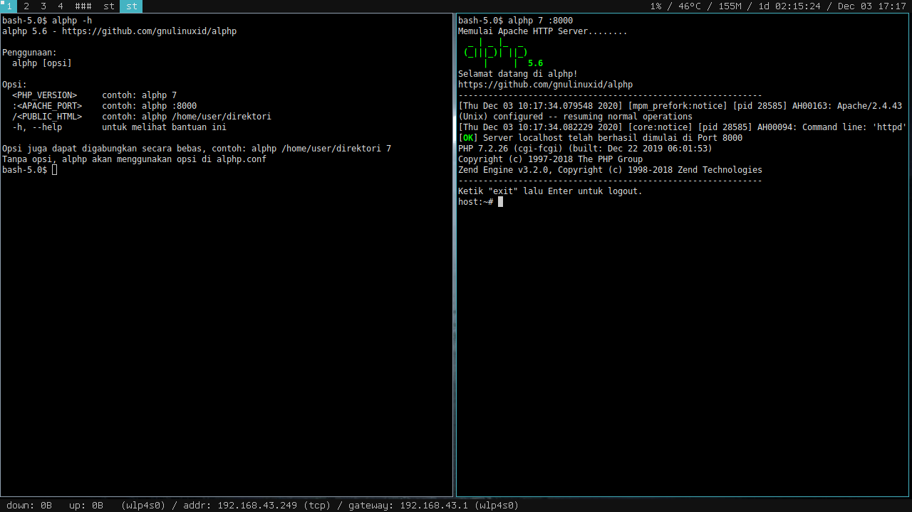

alphp 5.6
=========
alphp adalah [Apache](https://httpd.apache.org/) dan [PHP](https://www.php.net/) dalam sebuah wadah. Ini seperti [XAMPP](https://www.apachefriends.org/index.html), dengan keunggulan yaitu Apache dan pengguna tidak saling berebut perijinan. Lupakan masalah perijinan. Terima kasih kepada [PRoot](https://proot-me.github.io/). alphp ditenagai oleh [Alpine Linux](https://alpinelinux.org/) (minirootfs), hanya 6MB.

Pemasangan
----------
Pengunduhan hanya 11MB:

    $ wget https://github.com/gnulinuxid/alphp/releases/download/v5.6/alphp-5.6.sh
    $ chmod +x alphp-5.6.sh
    $ ./alphp-5.6.sh
Setelah terpasang, jalankan dengan:

    $ alphp
Jika shortcut tidak terpasang, jalankan dengan:

    $ $HOME/.alphp/5.6/bin/alphp
Konfigurasi
-----------
File config ada di .alphp/5.6/[alphp.conf](5.6/alphp.conf)

Catatan
-------
Karena alphp *rootless*, tidak mendukung port dibawah 1024. Standarnya adalah 8080. Tetapi jika menginginkan port misal 80, bisa menggunakan port forwarding. Berikut contoh jika menggunakan [socat](https://linux.die.net/man/1/socat):

    # socat tcp-listen:80,reuseaddr,fork tcp:localhost:8080
Screenshot
----------

